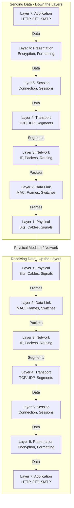

# The OSI Model: Explained Simply

Welcome! If you are diving into networking, cloud infrastructure, or enterprise middleware, you need to understand the OSI Model. But reading through dense academic textbooks can be overwhelming. 

This guide breaks down the 7 layers of the OSI model using simple, real-world analogies so they stick in your mind permanently.

## 📊 OSI Model Diagram

🧠 The Memory Trick
To remember the layers from bottom to top (Layer 1 to Layer 7), just remember this phrase:

Please Do Not Throw Sausage Pizza Away!

💻 The Software Layers (Layers 5, 6, & 7)
Layer 7: The Application Layer (The Interface)
This is the layer closest to you. It provides network services directly to the software applications you are using.

What it does: It's the actual protocol handling the data for your web browser, email client, or file transfer app.

Protocols: HTTP/HTTPS (Browsing), SMTP (Email), FTP (File Transfer).

The Analogy: Think of this as the storefront window you interact with. You are placing an order directly with the store clerk (the application) using a language you both understand.

Layer 6: The Presentation Layer (The Translator & Security Guard)
This layer takes the network data and formats it so your application can actually read it.

What it does: Handles data compression, translation (like ASCII to UTF-8), and Encryption/Decryption.

The Analogy: Imagine receiving a letter written in French inside a locked safe. This layer unlocks the safe (Decrypts SSL/TLS), translates the letter to English (Formats to JPEG, MP4, HTML), and hands it to you so you can easily read it.

Layer 5: The Session Layer (The Call Center Agent)
This layer establishes, maintains, and securely terminates the communication "session" between two devices.

The Analogy: Think of calling your bank's customer service. The Session layer "answers the phone" to start the connection, keeps the secure line open while you are actively transferring money, and formally "hangs up" when you log out so no one else can hijack your connection.

🌍 The Routing & Transport Layers (Layers 3 & 4)
Layer 4: The Transport Layer (The Shipping Manager)
This layer ensures that massive files are broken down into smaller, manageable pieces (Segments) and put back together correctly at the destination.

Protocols: TCP (Transmission Control Protocol) and UDP (User Datagram Protocol).

The Analogy: Imagine shipping a massive disassembled car across the country in 50 numbered boxes.

If using TCP, the shipping manager makes the receiver sign for every single box. If Box 43 is lost, TCP resends it (Reliable, but slower).

If using UDP, the manager just throws the boxes out of the truck and keeps driving (Fast, used for live video, but pieces can be permanently lost).

Layer 3: The Network Layer (The Global Postal System)
While Layer 2 handles the local hops, Layer 3 handles the global journey. It figures out the best path to route data from your local network to a completely different network anywhere in the world.

What it uses: Logical IP Addresses (which change depending on your location, like a mailing address).

The Analogy: This is the global postal system. It looks at the final destination (IP address) and decides if your package needs to go on a plane to London or a train to Delhi.

🧱 The Hardware Layers (Layers 1 & 2)
Layer 2: The Data Link Layer (The Local Delivery & Traffic Laws)
When those raw bits come off the cable, Layer 2 organizes them into structured packages called Frames.

What it uses: MAC Addresses (A permanent physical ID burned into your hardware at the factory, like a fingerprint).

The Analogy: Think of this as the local delivery driver. The driver doesn't care about the rest of the world; they only care about getting the package to the correct physical building on the exact same street. It also acts as the local traffic laws to prevent collisions on the wire.

Layer 1: The Physical Layer (The Road)
This is the raw hardware. It's the physical cables (coaxial, twisted pair, optical fiber) or radio waves (Wi-Fi) that transmit data as raw electrical signals or light pulses (0s and 1s).

What it does: Moves raw bits over a physical medium.

The Analogy: This is the physical road itself. It is the raw asphalt, the bridges, and the concrete that the delivery trucks (frames) physically drive over to get from point A to point B.
